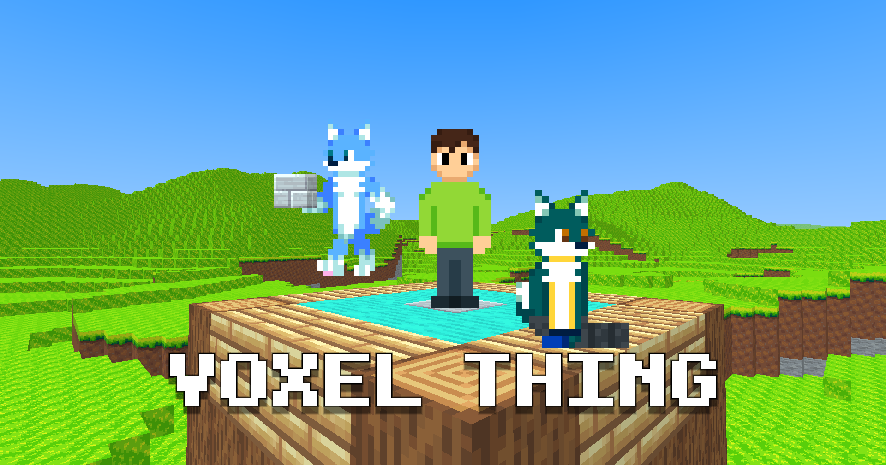

# ARCHIVED
**The Java version of Voxel Thing has been archived and is no longer supported. It has been ported to C# and can be found at https://github.com/BlueStaggo/VoxelThing.**

## Your generic barebones clone of a really popular block game
Nothing much here yet, huh? What will this be? Well, it is heading towards being some sort of standalone version of [Diverge](https://github.com/BlueStaggo/MCDiverge), a mod created by the same author as this random, uhh, voxel thing. This game might feature furry content, like how [DangerZone](https://orespawn.com) has anti-vax content, who knows? Voxel Thing will feature multiplayer and it will be free to play if it turns into a full on game.

## Controls
- WASD: Fly around
- Move mouse: Look around
- Space: Jump
- Double Space: Fly
- Shift: Fly down
- 1-9: Select block
- Left click: Place block
- Right click: Break block
- E: Inventory
- Q: No-clip
- R: Teleport to a random position
- F1: Toggle GUI
- F3: Debug menu
- F5: Toggle third person
- Escape: Open pause menu

## Compiling
To compile the Voxel Thing client, simply run `./gradlew :client:build`. To create a jar with libraries for your current platform, run `./gradlew :client:shadowJar`. To switch to a different platform, change the `voxelthing.client.platform` option in [gradle.properties](/gradle.properties) to any platform that LWJGL supports or set it to `all` to allow all platforms in a single jar.

## Credits

[//]: # (![TALON: Just a cool guy ig]&#40;doc/credits/talon.png&#41;)
